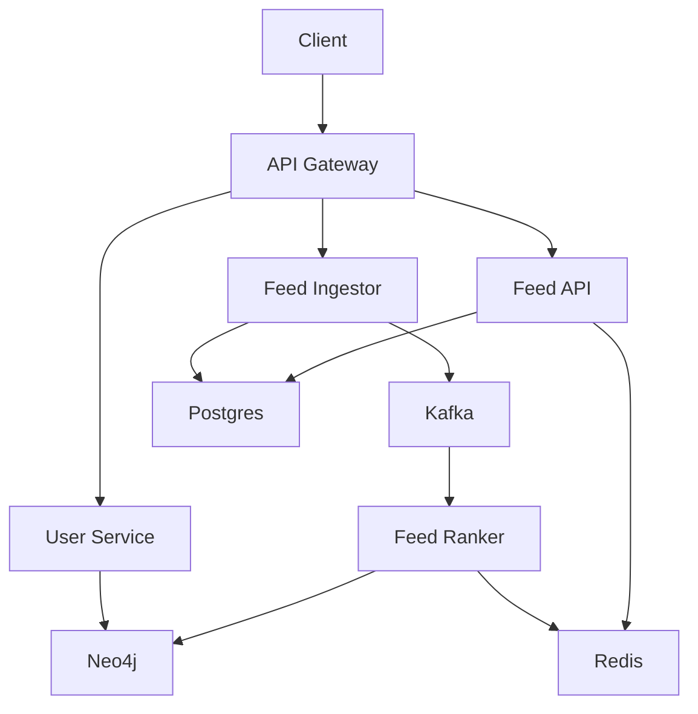
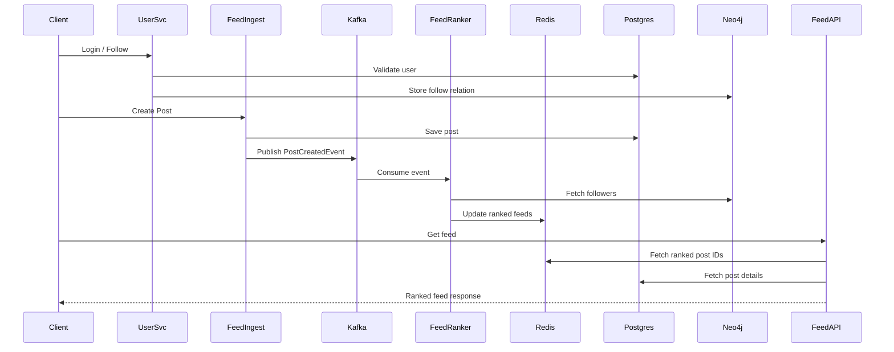
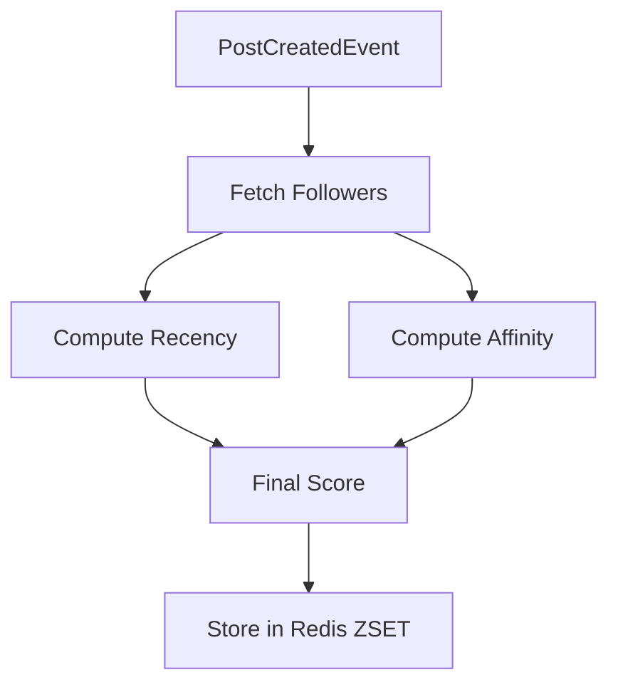
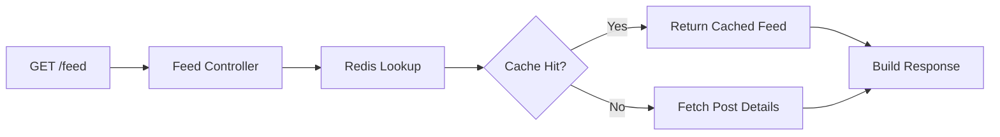
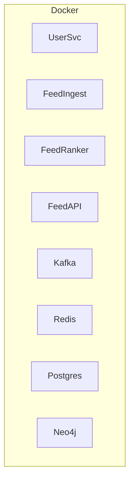

---

# SocialGraph – Real-Time Personalized Social Feed Ranking Engine

A production-grade, microservices-based system that delivers real-time, personalized social feeds using graph relationships, event-driven processing, and low-latency caching.

---

## Project Overview

**SocialGraph** models the backend of a modern social platform.
Users follow each other, create posts, and receive a ranked feed computed asynchronously using Kafka, Redis, and Neo4j.

The system is designed for **scale, low latency, resilience, and observability**, similar to real-world social media backends.

---

## Core Capabilities

* Real-time post ingestion via Kafka
* Graph-based social relationships (Neo4j)
* Personalized feed ranking (recency + affinity)
* Sub-100ms feed delivery using Redis
* JWT-based authentication
* Horizontally scalable microservices
* Production-grade monitoring and tracing

---

## High-Level Architecture



---

## Microservices Overview

### User Service

* Authentication (JWT)
* User profiles
* Follow / unfollow users
* Social graph persistence in Neo4j

### Feed Ingestor

* Post creation
* Stores posts in PostgreSQL
* Publishes `PostCreatedEvent` to Kafka

### Feed Ranker

* Consumes Kafka events
* Fetches followers from Neo4j
* Computes ranking score
* Updates Redis sorted sets

### Feed API

* Fetches ranked feeds from Redis
* Enriches posts from PostgreSQL
* Returns paginated feed

---

## Data Flow (End-to-End)



---

## Feed Ranking Logic



**Scoring Formula**

```
finalScore = 0.6 × affinityScore + 0.4 × recencyScore
```

---

## Request–Response Flow (Feed Retrieval)



---

## Functional Requirements (Short)

* User registration & login
* JWT authentication
* Follow / unfollow users
* Create text posts
* Personalized feed generation
* Pagination support

---

## Non-Functional Requirements (Short)

### Performance

* Feed retrieval < **100ms (P99)**
* Redis reads < **5ms**

### Scalability

* Horizontally scalable microservices
* Asynchronous event processing

### Reliability

* Retry with backoff
* Dead-letter topics
* Idempotent consumers

### Security

* JWT authentication
* BCrypt password hashing
* Rate limiting

### Observability

* Metrics: Prometheus
* Dashboards: Grafana
* Tracing: Jaeger
* Logs: ELK Stack

---

## Tech Stack (Summary)

* **Backend**: Java 17, Spring Boot 3
* **Databases**: PostgreSQL, Neo4j
* **Cache**: Redis
* **Messaging**: Kafka
* **Observability**: Prometheus, Grafana, Jaeger, ELK
* **DevOps**: Docker, Docker Compose, GitHub Actions

---

## Deployment Model



---

## Why This Project Matters

* Real-world event-driven architecture
* Graph-based personalization
* Cache-first read optimization
* Production-grade observability
* Strong system design interview signal

---

