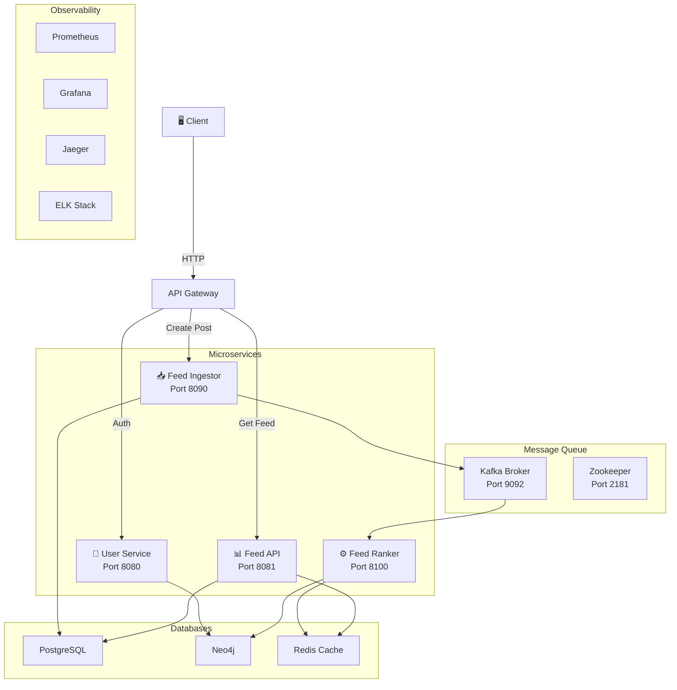

# **Social Graph – Feed Ranking Microservices System**

A production-grade, distributed social-media feed system designed using **Kafka, Redis, Neo4j, PostgreSQL** and **Spring Boot microservices**—similar to Instagram/Twitter feed ranking pipelines.

---

## **📌 Table of Contents**

* [Overview](#overview)
* [Architecture Diagram](#architecture-diagram)
* [Functional Requirements](#functional-requirements)
* [Non-Functional Requirements](#non-functional-requirements)
* [Tech Stack](#tech-stack)
* [ER Diagram](#er-diagram)
* [Neo4j Graph Schema](#neo4j-graph-schema)
* [Data Flow Diagram](#data-flow-diagram)
* [Service Component Diagram (LLD)](#service-component-diagram-lld)
* [Ranking Algorithm](#ranking-algorithm)
* [Deployment Architecture](#deployment-architecture)
* [Feed Retrieval Flow](#feed-retrieval-flow)
* [Authentication Flow](#authentication-flow)
* [Resilience & Error Handling](#resilience--error-handling)
* [Performance & SLOs](#performance--slos)

---

# **Overview**

This system provides a **high-performance social media feed**, using:

* Event-driven architecture
* Real-time ranking
* Distributed caching
* Graph-based follower modeling
* Scalable microservices

It mimics real-world systems used by Instagram, Facebook, Twitter.

---

# **Architecture Diagram**

---

# **Functional Requirements**

### ✔️ Users

* Register / Login
* Follow / Unfollow
* View other users

### ✔️ Posts

* Create post
* Store post in DB
* Publish event to Kafka

### ✔️ Feed System

* Rank posts per follower
* Store ranked feed in Redis
* Retrieve feed with pagination

### ✔️ Observability

* Metrics → Prometheus
* Logs → ELK
* Tracing → Jaeger

---
